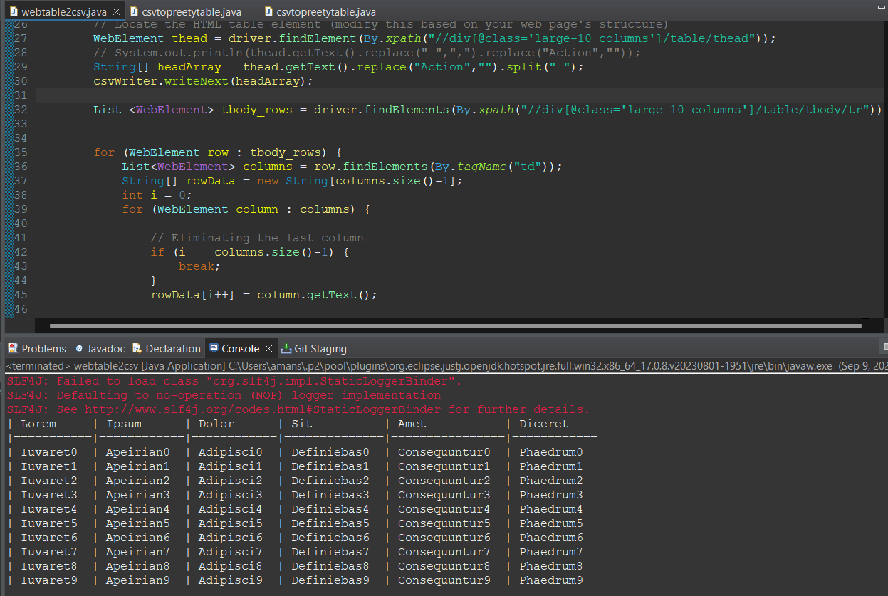

# Retrieving table from given site

### Objective
Given site http://the-internet.herokuapp.com/challenging_dom contains a table.
Table containing few random columns, we need to retrieve all the columns except action column (last column), and store it as csv file and print it in console.

### How to run ?

- Main method is available in `src/main/java/assignment/web2csv/webtable2csv.java` file

### Output

Output of the retrieved data from site
